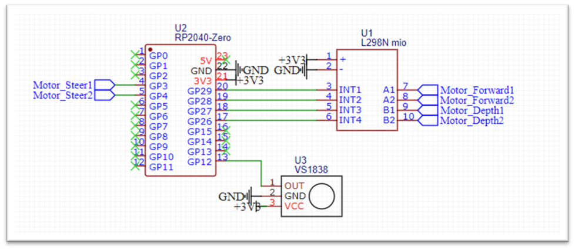

Infrared Submarine Controller
=======

This repository contains example code to control toy submarine like the one available through the following link using infrared:
[LSRC-332 Mini RC Submarine](https://nl.aliexpress.com/item/1005005888269003.html)

To do so, the control logic boards of the submarine are replaced with an RP2040-Zero microcontroller in combination with an l298N 2-chanel H-bridge motor driver. Schematics for the build can be found in this readme file.

The transmission circuit is trivial, an consists of a single IR LED and a fitting current limiting resistor on the selected pin. 

# Software

## Submarine_IRRemote.ino
This file contains the code for a remote control sample. This merely sends a repeated sequence of each possible command. This mainly serves as an example for how to send commands to the submarine.

## Submarine_ControllerBoard.ino
This file contains the code for the control logic of the submarine. This code shows how to receive IR commands, and how to control the motors connected to the submarine. 

## IDE
Both sketches can be openened in the Arduino IDE. Note that the library "IRremote" is needed.

## Components
### Submarine_IRRemote
- [Arduino Nano](https://nl.aliexpress.com/item/1005005967644175.html)
- Generic IR LED
- Generic current limiting resistor
### Submarine_ControllerBoard
- [RP2040 Zero](https://nl.aliexpress.com/item/1005005504313845.html)
- [L298N motor driver](https://nl.aliexpress.com/item/1005005247153041.html)
- [VS1838B IR receiver](https://nl.aliexpress.com/item/1005005249874271.htm)

## Wiring
### Submarine_IRRemote
Wiring is trivial. This setup only needs an IR LED connected through a current limiting resistor to pin D2 on the Arduino Nano.

### Submarine_ControllerBoard

The above wiring diagram can be used to connect the components.

## License
Copyright Niels Post 2023.
Distributed under the Boost Software License, Version 1.0.
(See accompanying file LICENSE_1_0.txt or copy at
https://www.boost.org/LICENSE_1_0.txt)